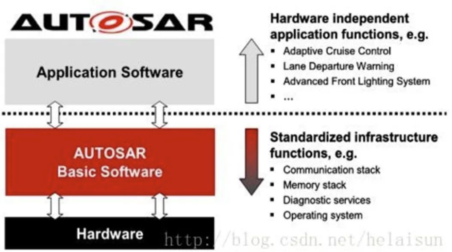
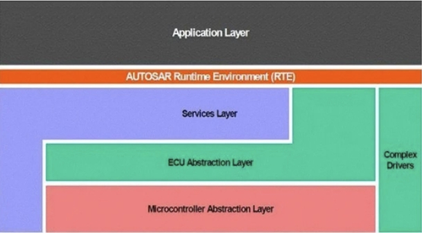
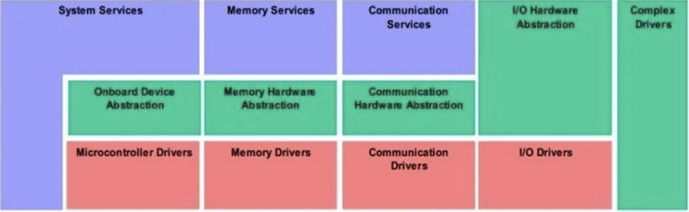

# AUTOSAR
## 概述
* 定义：一种开放式的汽车软件架构标准，为汽车制造商和供应商提供了提供统一框架，提升软件通用性、兼容性与开发效率。
* 需求：汽车系统日益增长的复杂性和多样性所带来的挑战，需要不同模块能够更好地协同工作，并有更高的灵活性和可扩展性。
* 目标：促进汽车系统的标准化、可重用性、可扩展性和互操作性，降低开发成本和复杂性。
* 设计原则：功能模块化，提高模块颗粒度来实现模块的高度可复用性；再通过不断复用、不断测试提高模块的质量。

## 标准构成
1. **软件组件标准**：定义了各类软件组件规范，涵盖动力、车身控制等组件。规定其功能、接口与交互方式，实现模块化开发与复用。不同车企依此标准开发的组件可通用，提升开发效率与软件质量。
1. **通信协议标准**：制定车内电子控制单元（ECU）通信协议。如DDS协议，用于业务解耦、加速通讯、降低风险。保障各组件数据交互准确高效，像发动机与变速箱控制单元借助特定协议协同工作。
1. **运行环境标准**：规范软件运行环境，包含操作系统、硬件抽象层等。确保软件在不同硬件平台稳定运行，满足汽车复杂电子系统需求。
1. **硬件接口标准**：对硬件接口进行标准化定义，实现软件与硬件的解耦。方便软件适配不同硬件，降低开发难度，如软件升级或硬件更换时，减少代码修改量。
1. **开发流程与方法标准**：涵盖软件从需求分析到测试的全流程规范。提供统一开发方法，要求使用符合标准的工具，提升开发效率与软件质量，降低错误率 。

## 架构
> [AUTOSAR架构深度解析](https://blog.csdn.net/usstmiracle/article/details/108248570)

* 分层架构：软件系统划分为不同的层次。每个层次负责不同的功能和任务，通过接口进行通信和交互。
* 模块化：功能划分为独立的模块或组件。每个模块负责特定的功能，可以独立开发、测试和维护。可以提高软件的可维护性、可重用性和可测试性。

> 软硬件分离的分层设计，对于OEM及供应商来说，提高了系统的整合能力，尤其标准化交互接口以及软件组件模型的定义提高了各层的软件复用能力(摆脱了以往ECU软件开发与验证时对硬件系统的依赖)，从而降低了开发成本，使得系统集成与产品推出的速度极大提升。
1. 软件和硬件模块的独立性
1. RTE作为虚拟功能总线VFB(Virtual Functional Bus)的实现，隔离了上层的应用软件层与下层的基础软件

### 层级

| 层 | 英文 | 说明 |
| - | - | - |
| 应用软件层 | Application Layer | 应用软件 |
| 运行环境 | RTE/Runtime Environment | 虚拟功能总线VFB、运行环境RTE |
| 基础软件层 | Application Layer | 基础软件 |

* 基础软件层

| 层 | 英文 | 说明 |
| - | - | - |
| 服务层 | Services Layer |  |
| ECU抽象层 | ECUAL/ECU Abstraction Layer | 解耦ECU |
| 微控制器抽象层 | MCAL/Microcontroller Abstraction Layer | 驱动和控制。解耦微处理器 |
| 复杂驱动 | Complex Device Drivers |  |

### 运行环境
* 标准化的通信接口和运行环境。主要作用是实现软件组件之间的通信、数据交换和同步，对软件组件的调度和管理(含守护)。
* 虚拟功能总线VFB
    * 是底层基础软件与网络拓扑结构的抽象，是AUTOSAR提供的所有通信机制的集合，在信息数据交互的过程中，应用程序被建模为组合组件。
    * 当系统进行配置时，软件组件就会被映射到指定ECU上，而同时组件间的虚拟连接也被映射到了CAN,FlexRay,MOST等总线上。最后软件组件利用预先定义好的端口，通过VFB来实现通信。
* 运行环境RTE：是具体单个ECU上对VFB接口的实现，可以理解成是面向对象的编程语言中对象的创建。

### 基础软件

| 层 | 软件 | 说明 |
| - | - | - |
| 服务层 | 系统服务 | 中断，资源，任务。类似OS |
| 服务层 | 内存服务 |  |
| 服务层 | 通信服务 |  |
| 服务层 | 诊断服务(UDS/unified diagnostic services) |  |
| ECU抽象层 | I/O，通信，内存，外设 |  |
| 微控制器抽象层 | I/O驱动，通信驱动，内存驱动，外设驱动 |  |