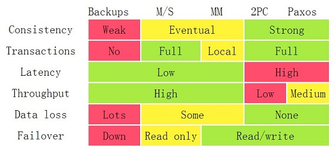

# 数据一致性

## 一致性类型
1. Weak 弱一致性：当你写入一个新值后，读操作在数据副本上可能读出来，也可能读不出来。比如：某些cache系统，网络游戏其它玩家的数据和你没什么关系，VOIP这样的系统，或是百度搜索引擎（呵呵）。
1. Eventually 最终一致性：当你写入一个新值后，有可能读不出来，但在某个时间窗口之后保证最终能读出来。比如：DNS，电子邮件、Amazon S3，Google搜索引擎这样的系统。
1. Strong 强一致性：新的数据一旦写入，在任意副本任意时刻都能读到新值。比如：文件系统，RDBMS，Azure Table都是强一致性的。

从这三种一致型的模型上来说，我们可以看到，Weak和Eventually一般来说是异步冗余的，而Strong一般来说是同步冗余的，异步的通常意味着更好的性能，但也意味着更复杂的状态控制。同步意味着简单，但也意味着性能下降。

## 方案指标

## 事务四大特性ACID
一致性（Consistency），而原子性（Atomicity）、隔离性（Isolation）、持久性（Durability）

## CAP，强一致性
* [CAP定理](http://www.ruanyifeng.com/blog/2018/07/cap.html)
* 分布式环境下（数据分布）要任何时刻保证数据一致性是不可能的，只能采取妥协的方案来保证数据最终一致性。这个也就是著名的CAP定理（Consistency，Availability和Partition Tolerance），它指出对于一个分布式计算系统来说，不可能同时满足以下三点：
  * 一致性（Consistency)（等同于所有节点访问同一份最新的数据副本）
  * 可用性（Availability）（对数据更新具备高可用性）
  * 容忍网络分区（Partition tolerance）（以实际效果而言，分区相当于对通信的时限要求。系统如果不能在时限内达成数据一致性，就意味着发生了分区的情况，必须就当前操作在C和A之间做出选择。）
* 方案都是3选2，一般用最终一致性
  1. CA without P：如果不要求P（不允许分区），则C（强一致性）和A（可用性）是可以保证的。但其实分区不是你想不想的问题，而是始终会存在，因此CA的系统更多的是允许分区后各子系统依然保持CA。
  1. CP without A：如果不要求A（可用），相当于每个请求都需要在Server之间强一致，而P（分区）会导致同步时间无限延长，如此CP也是可以保证的。很多传统的数据库分布式事务都属于这种模式。
  1. AP wihtout C：要高可用并允许分区，则需放弃一致性。一旦分区发生，节点之间可能会失去联系，为了高可用，每个节点只能用本地数据提供服务，而这样会导致全局数据的不一致性。现在众多的NoSQL都属于此类。

## BASE，最终一致性
* CAP理论的延伸
* BASE是指基本可用（Basically Available）、软状态（ Soft State）、最终一致性（ Eventual Consistency）

## 资料
* [数据库事务的隔离性（isolation）](https://zhuanlan.zhihu.com/p/27035174)
* [分布式CAP理论介绍](https://www.169it.com/article/4809733295047327965.html)
* [关于分布式系统的数据一致性问题](http://www.uml.org.cn/zjjs/201211065.asp)
* [CAP理论十二年回顾："规则"变了](https://www.infoq.cn/article/cap-twelve-years-later-how-the-rules-have-changed/)
