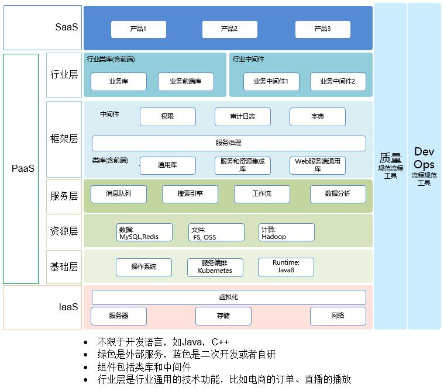

# 分布式系统架构

## 架构图

## 构成

| 类型 | 功能 | 组件 |
| - | - | - |
| 规范-通讯协议 | [RPC](distarch/rpc) | gRPC |
| 基础层 | 服务编排 | Kubernetes |
| 资源层-数据 | 缓存 | Redis |
| 资源层-数据 | 结构化数据库 | MySQL |
| 资源层-数据 | 非结构化数据库 | MongoDB |
| 资源层-文件 | 文件系统 | FastDFS, CEPH |
| 服务层 | 网络负载均衡 | Nginx |
| 服务层 | [锁](distarch/locker) | Redis |
| 服务层 | 消息队列 | Kafka |
| 服务层 | 搜索 | ES |
| 服务层 | 日志 | ELK |
| 服务层 | [全局ID](distarch/globalid) |  |
| 框架层 | [服务治理](distarch/sg/SUMMARY) | Spring Cloud |
| 框架层-sidecar | 权限，审计日志，字典等 |  |

## 微服务开发过程中的挑战
* [3个难题(拆分、事务、查询)](https://www.heguang-tech.com/blog/2020/architect/how-to-design-micro-service/)

### 事务
[参考](./distarch/transaction)

### 联表查询
* 命令查询责任分离(CQRS)

### 事件驱动架构
* 核心要点是可靠的事件投递和避免事件的重复消费。有两种实现。缺点：
  * 编程模式比传统基于事务的交易模式更加复杂
  * 必须实现补偿事务以便从应用程序级故障中恢复，例如，如果信用检查不成功则必须取消订单
  * 应用必须应对不一致的数据，比如当应用读取未更新的最终视图时也会遇见数据不一致问题。
  * 订阅者必须检测和忽略冗余事件，避免事件重复消费。

#### 可靠事件
[参考](./distarch/transaction)

#### 事件源(Event sourcing)

* **持久化事件，而不是对象**
  * 传统方式中，每个订单映射为ORDER表中一行。
  * 事件源方式中，订单以事件状态改变方式存储一个订单。
* 数据查询时，必须使用CQRS来完成查询业务

## 资料
* [漫谈何时从单体架构迁移到微服务？](https://mp.weixin.qq.com/s/VpQvqRc8UxZLs5L3iyJoQQ)
* [多研究些架构，少谈些框架](https://www.heguang-tech.com/blog/2020/architect/architect-or-framework/)
* [imooc公开课](http://class.imooc.com/sale/javaarchitect)
* [阿里云公开课](https://edu.aliyun.com/roadmap/microservice)
