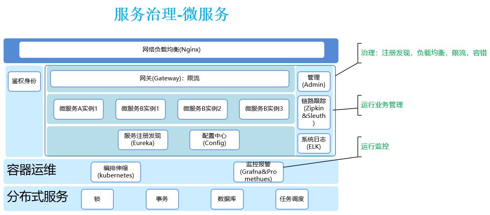
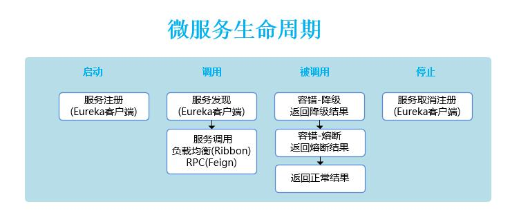

# 服务治理

## 微服务
### 趋势原因
1. 部署单元越来越小的粒度，加快交付效率，同时增加运维的复杂度。
1. 依赖方式从依赖库到依赖服务，增加了开发者选择的自由（语言，框架，库），提高了复用效率，同时增加了治理的复杂度。
1. 架构模式从单体应用到微服务架构，架构设计的关注点从分层转向了服务拆分。

### 成本
1. 组织架构
1. 运维
1. 服务治理

### 使用前提
1. 敏捷开发
1. 领域驱动设计(DDD)
1. 团队结构：每个模块是个独立团队，如订单模块
1. 技术架构
1. **DevOps**
1. 服务治理的管理工具，如调用链管理

## 功能清单
| 项 | 作用 | 示例 |
| :-: |  |  |
| 网关 | 外部请求入口 | 外部沟通，如业主要求刷漆 |
| 服务管理 | 服务镜像仓库和服务启停管理 | 装修公司，如提供人员 |
| 注册中心 | 服务实例注册/发现/续约/下线/自保 | 人员管理，如刷漆工到现场后登记 |
| 配置中心 | 配置项统一管理 | 装修信息，如用xx漆 |
| 链路监控 | 请求实例的flow和输入输出 | 操作记录，如某墙面的某次刷漆记录 |
| 流量管控 | 1. 负载均衡/限流  2. 熔断  3. 降级  | 1. 刷漆工甲当前工作量较多，后续刷漆请求可以交给工作量少的其他工人  2. 刷漆工都病倒了，业主被告知暂不提供服务。装修公司介入处理  3. 当前刷漆工作量超过刷漆工，为了完成尽可能多的工作，降低刷漆标准(比如播放低分辨率的视频)  |

## 知识
### 配置中心
* [主流微服务配置中心对比](https://www.javazhiyin.com/33919.html)
* 配置即控制
* 配置治理
  * 权限控制、审计日志
  * 灰度发布、配置回滚
  * 不同环境、集群管理
* 配置中心核心功能
  * 功能发布开关
  * A/B测试
  * QA测试
  * 运维开关
  * 限流
  * 黑白名单
  * 动态日志级别
  * 动态网关路由
  * 动态路由修改

### 服务治理系统
* 面向开发人员
  * 看服务状态和日志等
  * 服务依赖和调用链。pinpoint
  * 动态路由

### [熔断&降级](https://blog.csdn.net/guwei9111986/article/details/51649240)

| 项 | 触发 | 目的 | 处理方式 |
| :----: | -- | -- | -- |
| 降级 | 压力瞬间剧增 | 降低整体负荷 | 简单/延迟/暂停使用一些不重要/不紧急的服务，释放资源以保证核心交易正常运作或高效运作 |
| 熔断 | 某个下游服务故障 | 防止雪崩效应 | 熔断该节点微服务的调用，快速返回错误的响应信息。当检测到服务调用响应正常后，恢复调用链路 |

## 资料
* [什么是服务治理](https://www.jianshu.com/p/dd818114ab4b)
* [微服务实战（一）：微服务架构的优势与不足](http://dockone.io/article/394)
* [微服务架构设计的10个要点](http://developer.51cto.com/art/201807/579943.htm)
* [微服务实施失败总结：7大步骤高效推进微服务架构演进](http://developer.51cto.com/art/201708/549876.htm)
