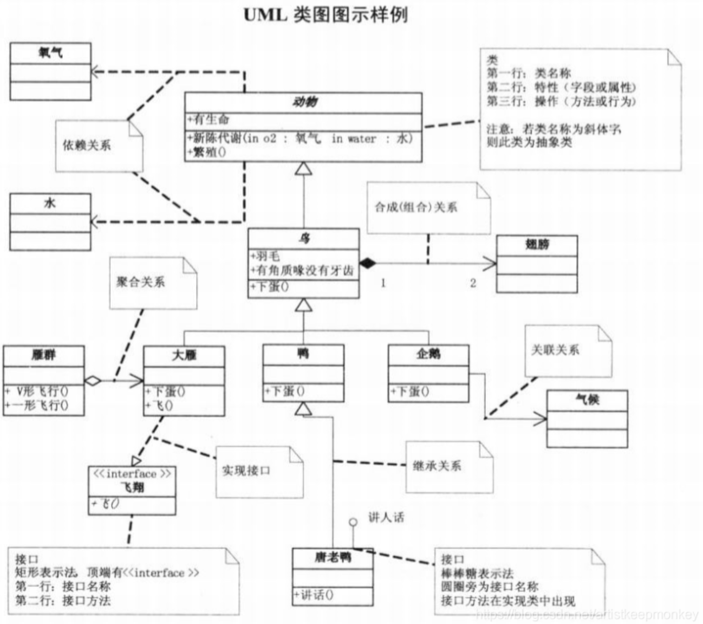

# 研发文档编写

## 阶段
| 阶段 | 目标 | 输出 | 说明 |
| :-: | - | - | - |
| 需求定义 | 要做啥产品 | 产品需求文档 |  |
| 系统分析/需求分析 | 功能怎么做 | 系统需求规格说明书 | 方法有HIPO图 |
| 系统设计 - 概要设计/系统架构设计 | 系统怎么做 | 概要设计说明书 |  |
| 系统设计 - 详细设计 | 每个模块怎么做 | 详细设计说明书 |  |

## 文档
| 文档 | 内容结构 | 说明 |
| :-: | - | - |
| 产品需求文档(PRD) | 产品的目标，用户故事，用户界面（UI）的草图，以及一些关键的业务和产品需求。 | 产品经理负责。指导开发团队理解产品的目标和产品需求 |
| 系统需求规格说明书(SRS) | 理解和定义系统的需求，包括功能需求、性能需求，接口需求，设计约束等。包括用例图，活动图，序列图等 | 系统分析师或开发者负责。指导开发团队进行系统设计和编码 |
| 概要设计/架构设计 | 确定系统的总体结构和主要组件，并定义各个组件之间的关系，定义与外部系统的关系。包括系统架构图，模块结构图，接口定义等 | 技术调研和技术路线选择 |
| 详细设计 | 定义系统中各个组件和模块的具体实现方式。这包括具体的数据结构，算法，接口，类和方法的设计等。包括类图，状态图等 | **如有结构调整（如分解出子模块等），必须返回到概要设计** |

## 产品需求文档VS系统需求规格说明书
* [系统需求规格说明书是PRD吗](https://zhuanlan.zhihu.com/p/59363702)。现在有些PRD就是SRS

| 文档 | 讲述角度 | 需求说明 |需求举例 |
| :-: | - | - | - |
| 产品需求文档(PRD) | 从用户和业务角度出发，描述了产品做什么和为什么要做。 | 用户希望产品提供的功能服务和技术规格，但并没有详细说明如何实现这些功能。 | 用户希望能够与其他学习者进行讨论和互动 |
| 系统需求规格说明书(SRS) | 从系统和技术角度出发，描述了产品如何实现，以满足PRD。 | 系统执行的任务或功能，包括用户界面的设计、用户可以执行的操作，以及系统如何响应这些操作 | 系统提供微信群或在线社区，让学习者能够与其他学习者交流和互动。 |

### 概念定义
#### PRD
* 产品需求：更为详细和正式，用户要什么
* 用户故事：敏捷开发中用来捕获产品或系统需求的一种方法，它以非技术性的语言描述了用户如何使用某个功能。目的是完善产品需求。
* 原型和流程图：产品级别讲清楚怎么做怎么用，更好的理解产品需求

#### SRS
* 需求用例图：图形化表示需求用例的工具。它使用图形符号和关系来展示系统中的角色、需求用例以及它们之间的关系。需求用例图可以清晰地展示系统功能的组织结构、用例之间的依赖关系和交互方式，帮助团队更好地理解和分析系统的功能需求。
* 需求用例（Use Case）：系统如何与用户（或其他系统）交互的系统行为
    1. 角色：与系统交互的用户或其他系统。
    1. 场景：描述系统如何与角色交互以实现特定目标的步骤。
    1. 前置条件：在用例开始之前必须满足的条件。
    1. 后置条件：在用例完成后满足的条件。
* 系统需求：系统的具体功能和操作，以下是系统功能需求
    1. 功能：系统提供的功能或服务。
    1. 输入：系统需要的输入数据。
    1. 处理：系统如何处理输入数据。
    1. 输出：系统生成的输出数据。

### 产品需求VS功能需求
1. 购物车
    * 产品需求：用户需要有一个购物车功能，保存想要购买的商品。能够在购物车中编辑商品，查看商品的详细信息等，能够从购物车直接进行结账。
    * 系统需求：系统提供一个购物车界面，用户可以通过点击商品页面的'添加到购物车'按钮将商品添加到购物车。在购物车界面，用户能够看到每个商品的名称、图片、价格和数量。用户能够更改购物车中商品的数量，这可以通过在数量字段输入新的数量并点击'更新'按钮来实现。购物车界面提供一个'结账'按钮，用户可以点击这个按钮来开始结账流程。
1. 用户注册
    * 产品需求
      * 功能：用户可以方便的通过提供电子邮件地址和密码来创建账户。
      * 技术规格：用户注册信息将被保存在数据库中，密码将进行加密存储，并且需要实施适当的安全措施来保护用户数据。
    * 系统需求
      * 功能需求规格（FRS）：具用户注册功能的行为和步骤，例如用户能够输入姓名、电子邮件地址和密码来注册账户，并且能够接收确认邮件以完成注册。
      * 用户界面设计：描述了用户注册页面的布局、字段和按钮等界面元素的设计要求，例如需要提供适当的输入验证和错误提示。
      * 性能需求规格（PRS）：定义了用户注册功能的性能要求，例如注册过程的响应时间在几秒钟内完成。

## UML
> UML（Unified Modeling Language，统一建模语言）是一种用于软件工程的标准建模语言。UML 提供了一系列图形表示和符号，用来描述软件系统的结构和行为。
面向对象的设计语言，不依赖于任何特定的编程语言。
有九种建模：用例图、类图、对象图、时序图、协作图、状态图、活动图、组件图、配置图(部署)

### [阶段建模](https://www.cnblogs.com/wsg25/p/9592915.html)
| 图 | 阶段 | 说明 | 常用 |
| :-: | - | - | - |
| 用例图 | 需求分析 | 系统所有功能的视图 | Y |
| 流程图! | 需求分析 | 系统所有功能的流程 | N |
| 泳道图! | 需求分析 | 按照职责/角色组织的业务流程图(对象(who)、顺序(when)、活动(what))，侧重对象的活动，可以有阶段。用于业务分析，也可用于非研发流程的设计 | Y |
| 类图 | 概要设计 | package+类 | Y |
| 对象图Class | 概要设计 |  | N |
| 时序图Sequence | 详细设计 | 对象间基于传递消息的时间顺序的协作，有生命线 | Y |
| 协作图 | 详细设计 | 对象间的交互过程，对象间的关联关系。是对象在时序图所有交互的视图 | N |
| 状态图Statechart | 详细设计 | 对象基于事件反应的动态行为，状态机 | N |
| 活动图activity | 详细设计 | 具体功能的实现，等同流程图 | N |

### [UML的类关系](https://blog.csdn.net/K346K346/article/details/59582926)

| 关系 | 符号 | 说明 | 示例 |
| :-: | - | - | - |
| 泛化(generalize) | 空心三角箭头 | 继承 |  |
| 实现(realize) | 空心虚线三角箭头 | 继承抽象类 |  |
| 聚合(aggregation) | 空心菱形箭头 | 集体与个体，非强依赖   聚合项可独立，具有不同的生命周期。 | 部门撤销了但人依然存在 |
| 组合(composition) | 实心菱形箭头 | 整体与部分，强依赖的**聚合关系**   组合项必须依赖于组合才有意义，具有相同的生命周期。 | 公司不存在了则部门也不存在了 |
| 关联(association) | 直线箭头 | 不同对象间的静态关系 | 类A是类B方法的参数 |
| 依赖(dependency) | 虚线直线箭头 | 不同对象间的运行期间的关系 | 类A是类B的属性 |

### 资料
* [UML用例图详解](https://juejin.cn/post/6844903805226582030)
* [UML类图详解](https://www.codetd.com/article/3271199)
* [时序图、流程图、状态图、协作图](https://blog.csdn.net/rosekin/article/details/14519277)
* [PlantUML简述](https://plantuml.com/zh/)
* 活动图/流程图
  * 判定点：需要做选择的地方，不同选择会影响后续步骤。
  * 分支：一项活动结束后，后续可以同时开始若干项活动。
  * 合并：若干项活动做完后，才能进行下一项活动。

## 资料
* 文档模板 : 本仓库目录/s/doc/dev/
* [visio设置多个相同类型图形的大小和位置](https://blog.csdn.net/jhsword/article/details/105301529)
