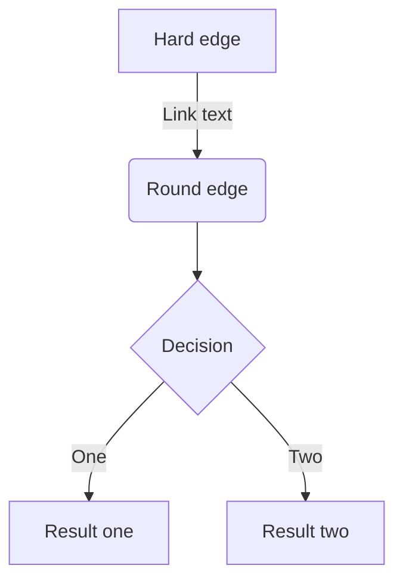

# markdown使用
* [Mermaid从入门到入土——Markdown进阶语法](https://zhuanlan.zhihu.com/p/355997933)

## 常用片段

* 代码块

```java
JavaRDD<String> textFile = sc.textFile("hdfs://...");
```

* 链接

```
* []()
1. []()
#模式的内部链接，#是根路径：如https://devops.wangyaqi.cn/#/soft/dev/git 链接写法是 [git](./soft/dev/git)
标准路径的内部链接：如https://devops.wangyaqi.cn/soft/dev/git 链接写法是 [git](/soft/dev/git)
```

* 图片

```
    // 相对路径，基于当前文件路径(目录)
   // 相对路径，基于当前文件的上一级路径(目录)
绝对路径无效！只能用相对路径！            // 绝对路径，基于根路径。
```

* 常量

| 字段 | 名称 | 说明 |
| :-: | - | - |
| MOBILE | 手机 |  |

```
| 字段 | 名称 | 说明 |
| :-: | - | - |
| MOBILE | 手机 |  |
```

* 术语

| 术语 | 说明 |
| - | - |
| 手机 |  |

* 表

| 列名 | 字段 | 类型 | 必须 | 说明 |
| :-: | - | - | - | - |
| 禁用 | disable | BOOL | Y | 功能开关<br>默认禁用 |

* API接口

| 名称 | 字段1 | 字段2 | 类型 | 必须 | 说明 |
| - | - | - | - | - | - |
| 身体 | body |  |  | Y |  |
| 身体-坐标 |  | pos | array | Y | [x,y,z] |
| 身体-速度 |  | speed | array | Y | [x,y,z] |

```json
{
  "body": {
    "pos": [
      0.11,
      0.91,
      1.49
    ],
    "speed": [
      0.01,
      0.01,
      -0.25
    ]
  }
}
```

* mermaid


