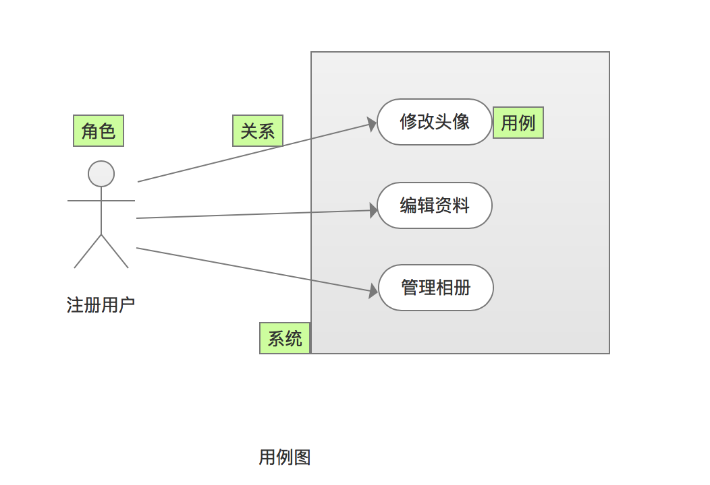

# 需求文档

## 编写
* [PRD到底该怎么写？](http://www.woshipm.com/pmd/192826.html)

### 文档结构
1. 术语，规则，参考文档
1. 产品概述：目标，安全级别，(硬件/软件/开发)环境
1. 产品设计：产品的功能需求用例图，产品的业务流程(流程图、泳道图、时序图)
1. 功能需求
    1. XX模块
        1. 模块的需求用例图
        1. 需求用例
        1. XX需求(非功能需求)【小规模系统可和"功能需求"同级】
            1. 需求用例
1. XX需求(非功能需求)
    1. XX分类[可选]
        1. 需求用例

## 知识
### 需求层级
* https://zhidao.baidu.com/question/682315294944797132.html

| 项 | 内容 | 示例 | 追溯表 |
| - | - | - | - |
| 用户需求 | / | / | / |
| 市场需求 | / | / | / |
| 产品(功能)需求 | 子系统间的 | 在决定购买之前用户想方便地比较一下几个同系列商品，以此在选择的时候做出更明智的决定。 | 追溯到市场需求或法律法规 |
| 子系统(功能)需求 | 子系统内的 | 让用户把意向购买的商品都放入“对比栏”，然后用户再点击“去对比”，就会在一个界面同时对比几个产品。 | 追溯到产品需求或法律法规 |

* 用户需求VS产品需求
    * 用户需求：用户的表达方式各异，提出的需求往往具有欺骗性质：我想要一匹更快的马。对用户来说他们只知道马，所以只能提出这样的需求。对产品经理来说，如果直接造出一匹更快的马，无疑是一件很难的事。
    * 产品需求：产品需求是很清晰的，我要一辆更快的汽车。对产品经理来说有很多办法可以做出更快的汽车。

### 需求类型
1. 功能需求
1. 非功能需求

| 项 | 内容 | 说明 |
| - | - | - |
| 接口 | 用户接口(UI), 软件接口(API/对外函数)，硬件接口(通讯/IO) |  |
| 安全 |  |  |
| 质量 |  |  |
| 性能 |  |  |
| 兼容 |  |  |
| 标准法规 | 网络安全等 |  |
| 维护 | 审计日志，备份还原等 | 不含功能需求"系统管理" |
| 安装卸载 |  |  |

### 功能需求里的通用模块
1. 系统管理模块
1. 警告提示模块

### 需求用例图

### 需求用例
| 字段 | 必需 | 说明 |
| - | - | - |
| 编号 | Y | 用编码，规则如：产品编码_子系统编码_一级功能编码_N级功能编码(可选) |
| 名称 | Y | 精简说明本用例 |
| 优先级 | N |  |
| 使用角色 | N |  |
| 场景描述 | N | 使用场景和背景 |
| 前置条件 | Y |  |
| 业务描述 | Y | 包括数据规则、状态逻辑规则和交互规则。   简单的用文字，复杂的可同时使用原型和UML(状态图，主流程，分支流程，异常流程)   用例不方便写的很细的可以把详细的记录到需求系统(如JIRA、TFS) |

### 资料
1. [BRD、MRD和PRD](https://www.zhihu.com/question/19655491) : 分别是做吗，做什么，怎么做
1. [市场需求文件（MRD）简介、框架、模板](https://zhuanlan.zhihu.com/p/57413137)
1. [产品经理十四章：产品需求文档(PRD)](https://developer.aliyun.com/article/655300)
1. [用原型代替PRD时，原型应该包含哪些内容](http://www.woshipm.com/rp/227461.html)

## 工具
1. [Axure RP 7.0快捷键 汇总](http://www.woshipm.com/pd/81482.html)
1. axure库：[axure](http://www.axure.com/community/widget-libraries)，[axureland](http://axureland.com/axure-widget-libraries)
