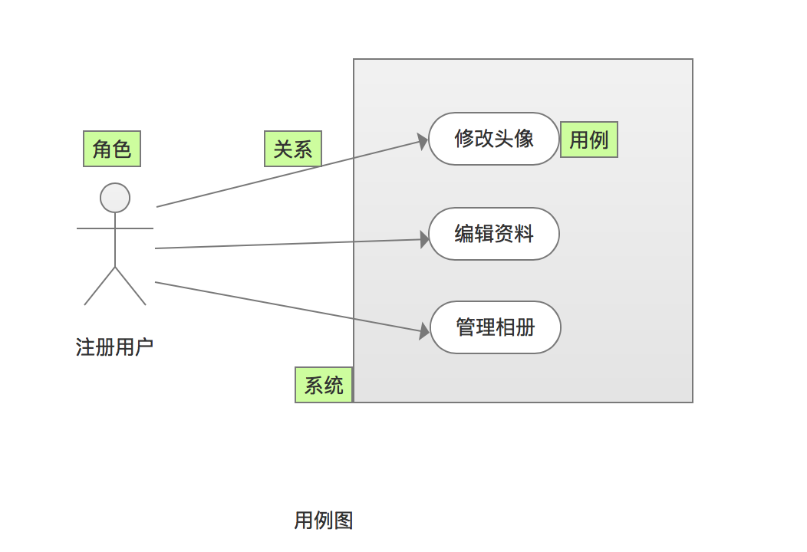
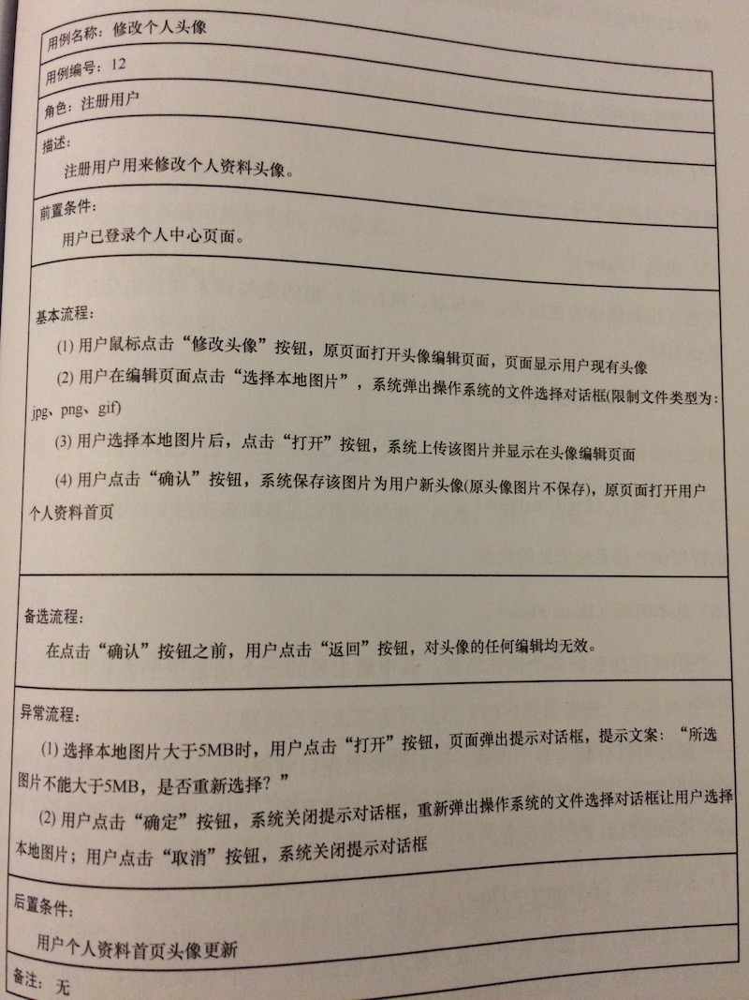

# 系统分析

## 系统需求类型
1. 功能需求
    * 功能需求里可以有通用模块，如系统管理模块、警告模块
1. 非功能需求

| 项 | 内容 | 说明 |
| - | - | - |
| 接口 | 用户接口(UI), 软件接口(API/对外函数)，硬件接口(通讯/IO) |  |
| 安全 |  |  |
| 质量 |  |  |
| 性能 |  |  |
| 兼容 |  |  |
| 标准法规 | 网络安全等 |  |
| 维护 | 审计日志，备份还原等 | 不含功能需求"系统管理" |
| 安装卸载 |  |  |

## 编写
### 需求用例图

### 需求用例
| 字段 | 必需 | 说明 |
| - | - | - |
| 编号 | Y | 用编码，规则如：产品编码_子系统编码_一级功能编码_N级功能编码(可选) |
| 名称 | Y | 精简说明本用例 |
| 优先级 | N |  |
| 使用角色 | N |  |
| 场景描述 | N | 使用场景和背景 |
| 前置条件 | Y |  |
| 业务描述 | Y | 包括数据规则、状态逻辑规则和交互规则。   简单的用文字，复杂的可同时使用原型和UML(状态图，主流程，分支流程，异常流程)   用例不方便写的很细的可以把详细的记录到需求系统(如JIRA、TFS) |

### 功能需求
* 本地图片上传
* 修改头像

## 分析方法HIPO
* [HIPO图](https://blog.csdn.net/wangjingna/article/details/41318739) = 层次结构图(H图) + IPO图
* [层次图和HIPO图---描绘软件结构的图形工具](https://blog.51cto.com/mengdong/1398151)
* [HIPO图、IPO图、H图的关系](https://blog.csdn.net/lvshihua/article/details/8545345)
