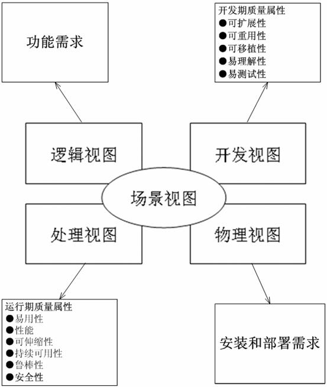

# 概要设计
## 架构
> 软件架构是系统的草图，不仅是代码编写而且包括部署，运行、开发等这些方面进行设计，
目的是为了保证软件开发、运行、扩展、性能、安全、伸缩等等质量的一个保证

* [软件架构纵横谈1：方法、模式与框架](https://www.cnblogs.com/windfic/p/14998414.html)
* [架构模型](http://www.ruanyifeng.com/blog/2016/09/software-architecture.html)：分层架构，事件驱动架构，微核架构，微服务架构，云架构

### 架构设计分类
>业务架构、应用架构、技术架构、代码架构、部署架构。
业务架构是战略，应用架构是战术，技术架构是装备。
* [架构分类四种架构方法](https://blog.csdn.net/weixin_43805705/article/details/127967264)

### 架构视图
* [架构设计五视图法](https://www.cnblogs.com/duanxz/p/4526763.html), [软件架构设计-五视图方法论](https://blog.csdn.net/nnsword/article/details/78109126)

| 项 | 内容 |
| :-: | - |
| 软件架构 | 对软件系统运行时元素的抽象，软件系统可能有很多层抽象，或由多重业务流程所组成，每层抽象或每个业务流程都有自己的软件架构。 |
| 系统架构 | 业务及其部署 |

| 视图 | 类型 | 内容 | 目标 |
| :-: | - | - | - |
| 逻辑架构 | 软件架构 | 逻辑元素组成和关系，逻辑元素可以是逻辑层、功能子系统、模块。别名有应用架构和系统架构 | 明确元素及其关系 |
| 技术架构 | 软件架构 | 分层 | 技术 |
| 运行架构 | 软件架构 |  | 解决运行中的问题，如并发 |
| 物理架构 | 系统架构 | 网络、服务器等设施和软件的部署架构 | 高性能、可伸缩性、易维护性，监控 |
| 数据架构 | 系统架构 | 基于数据的设施和软件的部署架构 | 高性能、高可用性、灾备 |

## 架构视图模型
* 架构视图模型是个架构模型，是描述系统架构的方法，有：RUP4+1视图模型、C4模型和RM-ODP等
* [分类1](https://juejin.cn/post/6844903588511088653), [分类2](https://blog.csdn.net/xuwei198603/article/details/46454321)

### 4+1架构视图模型
* [运用RUP 4+1视图方法进行软件架构设计](https://blog.csdn.net/apanious/article/details/51011946), [架构设计4+1视图的作用与关系](https://zhuanlan.zhihu.com/p/112531852)
* 不同架构视图承载不同的架构设计决策，支持不同的目标和用途：

* 视图

| 视图 | 英文 | 目标 | uml | 说明 |
| :-: | - | - | - | - |
| 场景视图 | Scenarios View | 系统的使用场景和用户需求 | 用例图 | 系统的功能和行为 |
| 开发视图 | Development View | 开发环境下的静态组织 | 包图、组件图、部署图 | 非业务的通用抽象设计 |
| 逻辑视图 | Logical View | 对象模型 | 包图、类图、组件图 | 系统的组件、类、模块以及它们之间的关系 |
| 过程视图 | Process View | 系统的并发和同步 | 活动图 |  |
| 物理视图 | Physical View | 系统的物理结构和部署环境 | 部署图 | 系统的硬件设备、网络拓扑和物理资源。 |

* 部署图的区别

| 视图 | 区别 |
| - | - |
| 开发视图 | 抽象设备。如数据存储服务，而不是数据存储服务器 |
| 物理视图 | 真实物理设备。如Web服务器、数据库服务器和数据存储服务器。Web服务器上部署了Web应用程序组件，数据库服务器上部署了数据库组件 |

* 组件图的区别

| 视图 | 区别 |
| - | - |
| 开发视图 | 非业务组件，如前后端等 |
| 逻辑视图 | 业务组件 |

* 包图的区别

| 视图 | 区别 |
| - | - |
| 开发视图 | 系统架构图，如MVC多层架构 |
| 逻辑视图 | 模块图，如用户管理，商品管理 |

## 模型框架
> 模型框架（Modeling Framework）是一种结构化的方法或标准，用于组织和描述系统或软件的各个方面和视图。它提供了一套共享的概念、规则和语义，用于创建、表示和交流系统或软件的模型。模型框架定义了一组规范和约定，以指导模型的创建和使用。它通常包括一些核心概念、模型元素、关系和规则，以及用于表示和描述系统各个方面的视图和视角。
种类：TOGAF、DoDAF、UAF

### TOGAF企业架构
* [TOGAF企业架构](https://zhuanlan.zhihu.com/p/442963069)有4种：业务架构、数据架构、应用架构、技术架构
* [资料](https://segmentfault.com/a/1190000019704801)
* [开放组体系结构框架TOGAF](https://zhuanlan.zhihu.com/p/47939015): 开发企业架构（Enterprise Architecture）的一套方法和工具。企业架构是承接企业业务战略与 IT战略之间的桥梁与标准接口，是企业信息化规划的核心。
