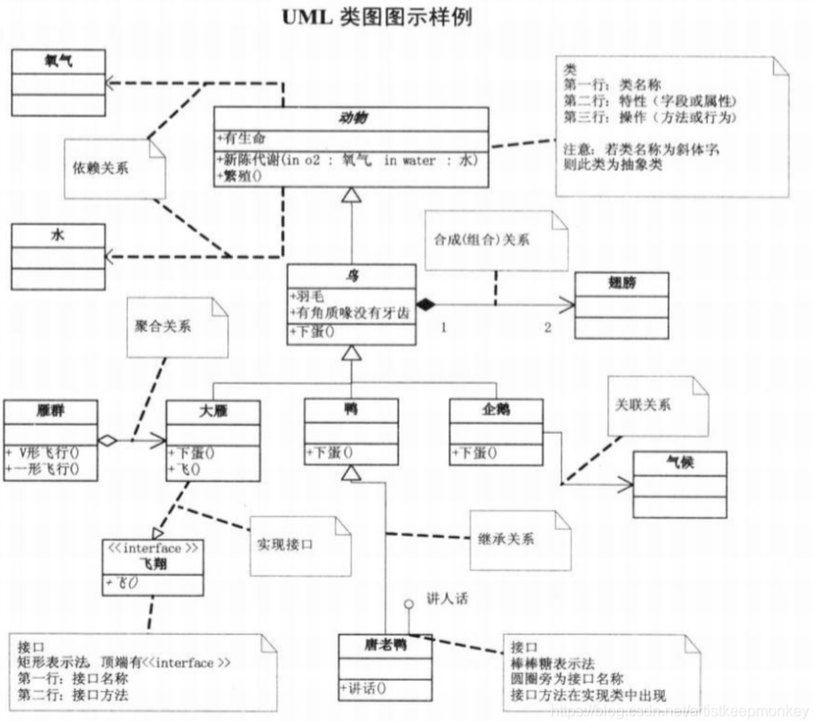

# UML
> [什么是UML](https://zhuanlan.zhihu.com/p/503813526), [官网](https://www.uml.org/)
UML（Unified Modeling Language，统一建模语言）是一种用于软件工程的标准建模语言。提供了一系列图形表示和符号，用来描述软件系统的结构和行为。
面向对象的设计语言，不依赖于任何特定的编程语言。

## 历史
1. 1997年，发布UML1.0
1. 2005年，发布UML2.0
1. 2005年，发布UML2.5

## 图
| 图类型 | 内容 | 图 |
| - | - | - |
| 静态结构图 | “系统是什么”：系统的静态结构，即系统的各个部分及它们之间的关系 | 类图、对象图、包图、组件图、部署图 |
| 动态行为图 | “系统做什么”：描述系统的动态行为，即系统的运行时行为和交互 | 用例图、活动图、序列图、协作图、状态图 |

| 图 | 英文 | 内容 |
| - | - | - |
| 用例图 |  |  |
| 包图 | Package Diagram | 系统的模块结构 |
| 类图 | Class | 系统的静态结构。类、接口及其关系 |
| 对象图 |  | 系统在某个具体时间点的实例化。对象实例及其关系 |
| 时序图 | Sequence | 对象间基于传递消息的时间和顺序的协作，有生命线 |
| 协作图 |  | 对象之间的协作关系和消息传递路径，是对象在时序图所有交互的视图 |
| 状态图 | Statechart | 对象基于事件反应的动态行为，对应的状态变化(状态机) |
| 活动图 | activity | 系统中的并发行为和流程。进程、线程、并发执行的活动以及它们之间的关系。 |
| 组件图 | Component Diagram | 系统的组件、组件之间的关系和依赖。 |
| 部署图 | Deployment Diagram | 系统运行时结构。系统的物理部署结构，包括硬件设备、软件组件和网络连接等。

### 活动图
* 重点元素
  * 判定点：需要做选择的地方，不同选择会影响后续步骤。
  * 分支：一项活动结束后，后续可以同时开始若干项活动。
  * 合并：若干项活动做完后，才能进行下一项活动。

## [研发阶段使用的图](https://www.cnblogs.com/wsg25/p/9592915.html)
| 阶段 | 图 | 说明 |
| - | - | - |
| 需求分析 | 用例图 |  |
| 需求分析 | 流程图 | 类似活动图。系统整体流程 |
| 需求分析 | 泳道图 | 类似时序图。按照职责/角色组织的业务流程图(对象(who)、顺序(when)、活动(what))，侧重对象的活动，可以有阶段。用于业务分析，也可用于非研发流程的设计 |
| 概要设计 | 类图 | 系统的整体结构和高层次的设计。**主要类及其主要属性方法**、类关系 |
| 概要设计 | 对象图 |  |
| 详细设计 | 类图 | **所有类及其属性方法**、类关系。 类 : 内部类、枚举等。 属性方法 : 访问修饰符、参数、返回类型等。 |
| 详细设计 | 时序图 |  |
| 详细设计 | 协作图 |  |
| 详细设计 | 状态图 |  |
| 详细设计 | 活动图 |  |

## [UML的类关系](https://blog.csdn.net/K346K346/article/details/59582926)

| 关系 | 符号 | 说明 | 示例 |
| :-: | - | - | - |
| 泛化(generalize) | 空心三角箭头 | 继承 |  |
| 实现(realize) | 空心虚线三角箭头 | 继承抽象类 |  |
| 聚合(aggregation) | 空心菱形箭头 | 集体与个体，非强依赖   聚合项可独立，具有不同的生命周期。 | 部门撤销了但人依然存在 |
| 组合(composition) | 实心菱形箭头 | 整体与部分，强依赖的**聚合关系**   组合项必须依赖于组合才有意义，具有相同的生命周期。 | 公司不存在了则部门也不存在了 |
| 关联(association) | 直线箭头 | 不同对象间的静态关系 | 类A是类B方法的参数 |
| 依赖(dependency) | 虚线直线箭头 | 不同对象间的运行期间的关系 | 类A是类B的属性 |

## 资料
* [UML用例图详解](https://juejin.cn/post/6844903805226582030)
* [UML类图详解](https://www.codetd.com/article/3271199)
* [时序图、流程图、状态图、协作图](https://blog.csdn.net/rosekin/article/details/14519277)
* [PlantUML简述](https://plantuml.com/zh/)
