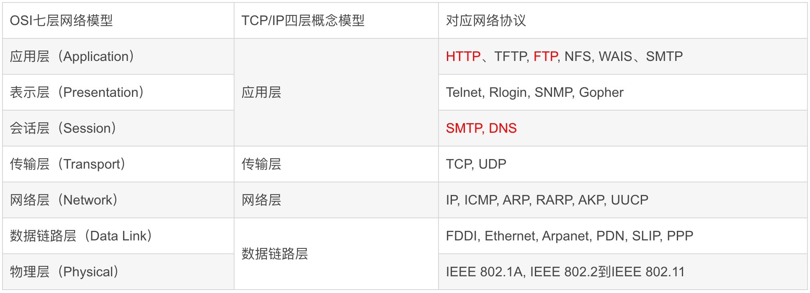

# 网络知识

## 资料
* [OSI七层模型与TCP/IP四层模型](https://blog.csdn.net/qq_39521554/article/details/79894501)

* [互联网通讯原理](https://segmentfault.com/a/1190000023316912)
  * 核心概念是交换和路由
  * 路由：请求通过路由表跳跃到下个点，路由算法会动态维护网络拓扑
  * 通过自治系统简化网络复杂度，本质是多层网络，可以简化路由表和路由算法。
* [ip段和掩码说明，如24](http://www.nocidc.com/News/New-96.html)
* Socket的四个构成：服务端地址、服务端端口、客户端地址、客户端端口。1台服务器可以同时支持远超65536个socket/请求

# HTTP协议
## 服务异常场景
| 场景 | 返回 | 说明 |
| :-: | - | - |
| 客户端无网络 | 无 |  |
| web服务(nginx)停止 && API服务停止 | 无 |  |
| web服务(nginx)运行 && API服务停止 | 502 |  |
| web服务(nginx) && API服务运行 && API服务处理异常 | 500 |  |

# 长连接
## 理解
* Socket和WebSocket，不是RPC模式(请求响应模式)。本质上用于通知和请求。
* 有两种场景
  1. 无需返回结果的通知：请求
  1. 需返回结果的请求：请求，请求结果(异步返回)。
* 请求和请求结果必须要有唯一对应的key，可以异步处理。比如pos机的流水号。
* http模式(API)本质是一次短连接，也是异步返回请求结果，只是这个返回结果无需做key关联，因为当前连接只有一个请求。

### 为何要有心跳来保活
* TCP本身有心跳包机制(SO_KEEPALIVE，默认2小时)。但是检查不到以下情况：
  1. 机器断电、网线拔出、防火墙断线。
  1. 中间节点（如防火墙）自动把一定时间之内没有数据交互的连接给断掉。

## Websocket
### 资料
* Websocket是socket，也可以支持N个。如使用了nginx作为代理，则因为nginx作为remoteIp只有1个，导致websocket连接数最多六万多，如果是一台服务器则要除2
* [看完让你彻底搞懂Websocket原理](http://blog.csdn.net/frank_good/article/details/50856585)
* [websocket知识](https://www.ruanyifeng.com/blog/2017/05/websocket.html)
* [WebSocket与TCP、Http的关系](http://blog.csdn.net/linwei_1029/article/details/47836249)
  * WebSocket协议是一个独立的基于TCP的协议。它与HTTP唯一的关系是它的握手是由HTTP服务器解释为一个Upgrade请求。
  * 发起连接是http，传输是tcp，所以要开TCP的80端口

### 规模
* [Netty-WebSocket长连接推送服务](http://blog.csdn.net/z69183787/article/details/52505249)
* [Websocket推送中心(三)-单机100W连接(C1000K)达成](https://shibd.github.io/2019/08/17/Message-Center-3/)
